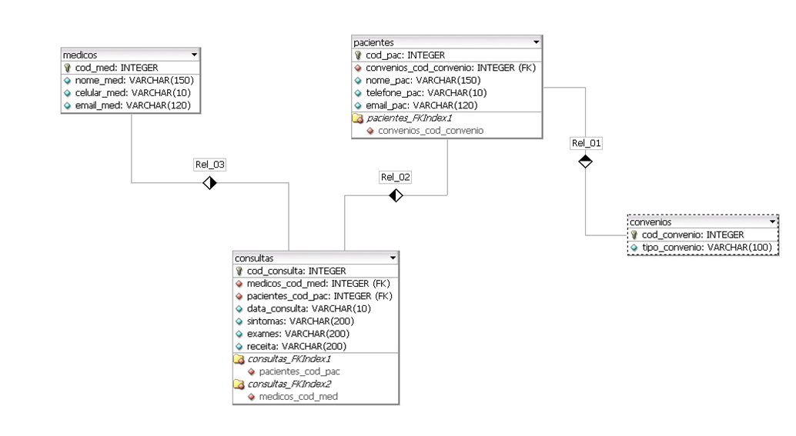

# Prova de Banco de Dados

Prova realizada no dia 06/07/2016 na cadeira de Banco de Dados.

## Enunciados

1. Criar o modelo entidade relacionamento para uma Clínica Médica, no DB-Designer, conforme imagem abaixo: **1,0 ponto**
2. Salvar o arquivo da modelagem com o nome: modelo_clinica   

3. Usar o DB-Designer para gerar as tabelas em um novo banco de dados do MySQL que terá o nome de “hospital”
4. Usar o MySQL_Front para inserir os dados, abaixo, nas tabelas. 
- Tabela: medicos
  - `insert into medicos values ("","Dr. Otavio", "808080", "otavio@gmail.com");`
  - `insert into medicos values ("","Dr. Adolfinho", "777777", "adolfinho@hotmail.com");`
  - `insert into medicos values ("","Dra. Clarice", "666666", "clarice@icloud.com");`
  - `insert into medicos values ("","Dr. Fred Flintstone", "555555", "fflintstone@terra.com.br");`

- Tabela: convenios
  - `insert into convenios values ("","Unimed");`
  - `insert into convenios values ("","Golden Cross");`
  - `insert into convenios values ("","Bradesco Saúde");`
  - `insert into convenios values ("","Amil");`
  - `insert into convenios values ("","Ameplan");`

- Tabela: pacientes
  - `INSERT INTO pacientes VALUES("", 1,"Fernando Miguel", "200200", "fernando@hotmail.com");`
  - `INSERT INTO pacientes VALUES("", 1,"Moacyr Lima e Silva", "2482929", "moacyr@gmail.com");`
  - `INSERT INTO pacientes VALUES("", 1,"William Pereira Alves", "4486464", "william@hotmail.com");`
  - `INSERT INTO pacientes VALUES("",1, "Fernanda Caetano Gois", "3447676",  "fernanda@hotmail.com");`
  - `INSERT INTO pacientes VALUES("",2, "Marcelo Chaves Ladeira", "3685555", "marcelo@gmail.com");`
  - `INSERT INTO pacientes VALUES("",2,  "Pedro Luiz Côrtes", "1842828", "pedro@hotmail.com");`
  - `INSERT INTO pacientes VALUES("", 2, "Astrogildo Danubio", "1842727", "astrogildo@live.com");`
  - `INSERT INTO pacientes VALUES("",3, "Geraldo Cervelin", "2085959", "geraldo@yahoo.com.br");`
  - `INSERT INTO pacientes VALUES("", 3, "Elisberto Nogueira da Silva", "1602222", "elisberto@live.coml");`
  - `INSERT INTO pacientes VALUES("",3,  "Carlos Roberto Yamamoto", "2803636",  "carlos@hotmail.com");`
  - `INSERT INTO pacientes VALUES("",3, "Fausto de Paschoal", "2644343", "fausto@globo.com");`
  - `INSERT INTO pacientes VALUES("",3, "Marcos Freire Antunes", "3203211", "marcos@terra.com.br");`
  - `INSERT INTO pacientes VALUES("",3, "Élia Yathie Matsumoto", "2403214",  "elia@hotmail.com");`
  - `INSERT INTO pacientes VALUES("",3, "Claudio Venancio", "1529595", "claudio@live.com");`
  - `INSERT INTO pacientes VALUES("", 3, "William Pereira Alves", "5846969", "william@yahoo.com.br");`
  - `INSERT INTO pacientes VALUES("",3, "Ronaldo Oliveira", "5046565", "ronaldo@gmail.com");`
  - `INSERT INTO pacientes VALUES("", 1,"Bartolomeu Silva", "27245454", "bartolomeu@uol.com.br");`
  - `INSERT INTO pacientes VALUES("",2, "Tiburcio Aguiar", "30412121", "tiburcio@uol.com.br");`
  - `INSERT INTO pacientes VALUES("",1, "Adriana Vieira", "4404444", "adriana@terra.com.br");`
  - `INSERT INTO pacientes VALUES("",2, "Edvaldo Barbosa", "3923922", "edvaldo@yahoo.com.br");`
  - `INSERT INTO pacientes VALUES("", 5, "Ernesto Gato", "456456",  "ernesto@live.com");`
  - `INSERT INTO pacientes VALUES("", 5, "Moacyr Passo Dias Aguiar", "3232132", "moacyr@gmail.com");`
  - `INSERT INTO pacientes VALUES("",5, "João Mão Grande", "2242929", "joao@gmail.com");`
  - `INSERT INTO pacientes VALUES("", 5, "Sandro Sotille", "1717171", "sandro@icloud.com");`
  - `INSERT INTO pacientes VALUES("", 5, "Nelson Lava Jato", "1843636","nelson@uol.com.br");`
  - `INSERT INTO pacientes VALUES("", 5, "Samir Salim Sumiu", "288288", "samir@terra.com.br");`
  - `INSERT INTO pacientes VALUES("", 5, "Délio Pinto Guerrini", "20829292","delio@gmail.com");`
  - `INSERT INTO pacientes VALUES("", 4, "Francisco Capuano", "5525521", "francisco@terra.com.br");`
  - `INSERT INTO pacientes VALUES("", 4,"Rômulo Albuquerque", "1441443", "romulo@live.com");`
  - `INSERT INTO pacientes VALUES("", 4," Eustójo Ribeiro", "19239393","eustojo@hotmail.com");`
  - `INSERT INTO pacientes VALUES("", 4,"José Enio Filoni", "216216", "jose@gmail.com");`
  - `INSERT INTO pacientes VALUES("", 4, "Adilson da Silva Lima", "3043737", "adilson@live.com");`
  - `INSERT INTO pacientes VALUES("", 4,"Tati Quebra Barraco", "8923976", "tati@live.com");`
  - `INSERT INTO pacientes VALUES("", 4, "Pepe Neném dos Santos", "2408881","pepe_nenem@live.com");`
  - `INSERT INTO pacientes VALUES("", 4,"Anteu Fabiano Gasparini", "2242212", "anteu@terra.com.br");`
  - `INSERT INTO pacientes VALUES("", 2, "Fernanda Caetano", "3684343"," fernanda@yahoo.com.br");`
  - `INSERT INTO pacientes VALUES("", 2, "Alissom Lima", "3603695", "alissom@live.com");`
  - `INSERT INTO pacientes VALUES("", 2, "Maria Izabel", "2082929", "maria_izabel@gmail.com");`

- Tabela: consultas
  - `INSERT INTO consultas VALUES("", "1", "1", "12/05/2015", "Febre", "Sangue", "Chá de camomila");`
  - `INSERT INTO consultas VALUES("", "1", "1", "14/04/2016", "Tontura", "Urina", "Repouso");`
  - `INSERT INTO consultas VALUES("", "2", "2", "11/03/2015", "Pressão Alta", "Sangue", "Sonrisal");`
  - `INSERT INTO consultas VALUES("", "2", "2", "14/04/2016", "Dor de Cabeça", "Tomografia", "Somalgim Cardio 100mg");`
  - `INSERT INTO consultas VALUES("", "4", "3", "02/07/2016", "Dor no rim", "Radiografia", "Bi-Profenid 60mg");`

5. Execute as consultas (query) SQL abaixo:  **4,0 pontos** 
   1. select para retornar os campos nome do paciente, telefone do paciente e tipo de convenio de todos pacientes em que
   o tipo convenio é igual a "Unimed"
   2. select para retornar os campos nome do paciente, nome do medico, exames e tipo de convenio de todas consultas onde 
   exames é igual a “Sangue” 
   3. select para retornar nome do paciente, email do paciente e telefone do paciente e tipo convenio do paciente que 
   tem codigo igual a 18 
   4. select para retornar os campos nome do medico,  celular do medico e email do medico que tem código igual a 4
   5. select para retornar os campos nome do medico e o nome do paciente da consulta realizada em 02/07/2016 
   6. select para retornar todos os dados do médico que o número do telefone é igual a 666666 
   7. select para retornar o nome do paciente e o email de todos pacientes que tem email do hotmail 
   8. select para retornar os campos nome do paciente, email do paciente, nome do medico e data da consulta de todos 
   pacientes que consultaram em “14/04/2016”

### Respostas

5. ..
   1. ..
   2. ..
   3. ..
   4. select nome_med, celular_med, email_med from medicos where cod_med=4 
   5. ..
   6. select * from medicos where celular_med="666666"
   7. select nome_pac, email_pac from pacientes where email_pac like ("%hotmail%")

---

O códigos foram desenvolvidos no dia 06/07/2016 na cadeira de Banco de Dados, enquanto ministrada pelo Prof. Mauricio
Santos.